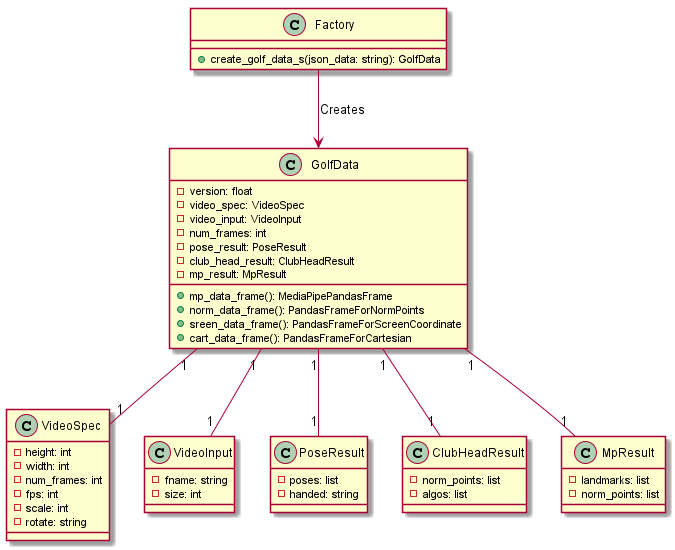

# Introdction
This package provides a utility for analyzing a golf swing. The input data is represented as a json file
generated by [GolfTracker](https://pypi.org/project/golftracker/). 

The json file structure is represented by a data class "GolfData". A factory method is used to create it from the json filename.

The structure of the *GolfData* class is shown below.



## Installation
Install the package in your virtual env.

```
pip install golftrainer
```

## Demo
For this purpose we will use **data/demo.json** as an example. This file is same as "00001.json" from the below google drive.

### Setup Jupyter Notebook
To make the notebook run under my virtual env (say 'venv'), follow the following steps.

```

pip install jupyter

```

Or for existing install create a new kernel.

```
ipython kernel install --user --name=venv

```

```
cd notebooks/demo

jupyter notebook demo1.ipynb 
```

Once we have the notebook the following commands we can use the GolfData object to access the parameters.


## Generated Data
Various sample golf swing videos shot down the line on a right handed golf player with the corresponding json file are stored in this [GoogleDrive](https://drive.google.com/drive/folders/1TDUnGjP1wh1gZeN1EZdJOO4AeYuMLnkO?usp=sharing). Each video file (either a mp4 or mov) has 2 output files. The ".pkl" is the pickle database and ".json" is the file that we will use for this package to measure the various metrics associated with the swing.

